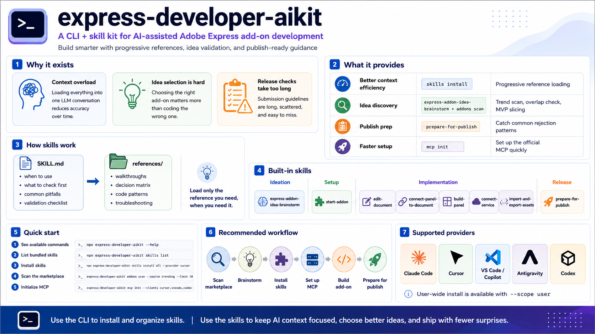

# express-developer-aikit

[한국어 README](./README.ko.md)

A CLI and skill kit that complements Adobe Express's official MCP for AI-assisted add-on development.

## Overview



## Why this exists

Adobe Express has an official MCP, but using it alone leaves a few real pain points when you're actually shipping add-ons.

**1. MCP alone uses context inefficiently**
Throwing everything into the LLM at once works for the first few messages. As the conversation grows, accuracy drops — relevant details get pushed out by less relevant ones. This CLI ships skills that load context progressively: a short main `SKILL.md` for the workflow, and separate `references/` files the agent only loads when the task actually needs them. Same context budget, better answers.

**2. Picking what to build is the hardest step, not the coding**
The biggest pain point in add-on work isn't writing code — it's deciding *what's worth writing*. Without a read on what's already shipped and what users currently want, you can finish a clean implementation and end up with something nobody needs. This is why the trending scan + brainstorm skill are paired up front, and why the broader snapshot lookup now exists beside them.

**3. Pre-submission guideline checks require reading the full docs**
Adobe Express add-on submission guidelines are long, and rejection patterns are spread across multiple sections. This CLI's `prepare-for-publish` skill organizes those guidelines into a reference tree so you can catch the common rejection patterns without reading every doc end to end.

## What's in the box

Each capability maps directly to one of the pain points above.

| Pain point | Tool |
|---|---|
| Context efficiency + answer quality | `skills install` (progressive reference structure) |
| Idea-stage decisions | `express-addon-idea-brainstorm` skill + `addons scan` |
| Pre-submission guideline check | `prepare-for-publish` skill |

Plus `mcp init` for setting up the official Adobe Express MCP across clients quickly.

## Install

Use it on demand with `npx`:

```bash
npx express-developer-aikit --help
npx express-developer-aikit skills list
npx express-developer-aikit skills install all --provider cursor
```

Or install globally:

```bash
npm install -g express-developer-aikit
```

For local development:

```bash
git clone https://github.com/irelander/express-developer-aikit
cd express-developer-aikit
npm run check
npm test
npm start -- --help
```

## Core — skills

The actual value of this CLI lives in the skills. The commands exist to install and feed them.

### `skills install <name>`

A skill here is a markdown bundle the agent loads when the task type matches. Instead of dumping every relevant detail into the context up front, it's structured to load progressively:

- **Main `SKILL.md`** — short. When to use it, what to inspect first, common pitfalls, validation checklist.
- **`references/` directory** — sample walkthroughs, decision matrices, code patterns, troubleshooting tables. The agent loads these only when the task actually needs them.

This is the whole point. Loading every reference upfront pushes important details out of context as the conversation grows. Pulling references in only when needed keeps the same budget producing better answers.

The skills themselves live as real markdown under [`skills/`](./skills) in this repo. The CLI is convenience — you can also just copy any skill folder from the repo into your provider's skill directory by hand, no Node or npm needed.

```bash
express-developer-aikit skills install start-addon --provider cursor
express-developer-aikit skills install edit-document --provider claude-code,vscode
express-developer-aikit skills install all --provider codex --scope user
```

The installer writes to provider-specific locations:

| Provider | Location |
|---|---|
| Claude Code | `.claude/skills/` |
| Cursor | `.cursor/skills/` |
| VS Code / Copilot | `.github/skills/` |
| Antigravity | `.agents/skills/` |
| Codex | `.agents/skills/` plus `agents/openai.yaml` |

Use `--scope user` for user-level installs. Without `--provider`, the CLI only auto-detects when the workspace clearly belongs to one provider — for mixed setups, pass it explicitly.

Codex usually picks up new skills without restart. Claude Code may need a restart the first time you create `.claude/skills/`.

### `skills list`

Prints the bundled skills with a one-line description.

## Built-in skills

| Skill | Stage | Pain point it addresses |
|---|---|---|
| `express-addon-idea-brainstorm` | Ideation | Idea decision — overlap check, feasibility, differentiation, MVP cut |
| `start-addon` | Setup | Template, manifest, runtime layout selection |
| `edit-document` | Implementation | Document sandbox work — pages, selection, element APIs |
| `connect-panel-to-document` | Implementation | Panel ↔ sandbox runtime bridge design |
| `build-panel` | Implementation | Spectrum panel UI, theming, state design |
| `connect-service` | Implementation | OAuth flows, token lifecycle, third-party integration |
| `import-and-export-assets` | Implementation | Drag-and-drop, renditions, export permissions, PPTX |
| `prepare-for-publish` | Release | Pre-submission guideline review — rejection patterns, browser QA, listing metadata |

Each skill follows the progressive reference pattern: a focused main `SKILL.md` plus a `references/` directory the agent loads only as needed. The two skills below carry the most user-visible weight, so they get a longer write-up.

### `express-addon-idea-brainstorm`

Takes scan output and walks through idea validation in three layers: market overlap, Adobe Express capability fit, and MVP cut. The skill pushes the model to do narrow snapshot searches, inspect single add-on records when needed, and run a capability feasibility pass against the real Adobe Express runtime model before recommending scope. It also points to the existing implementation skills when the idea depends on panel UI, document sandbox work, OAuth, import/export flows, or publish-review constraints. Snapshot lookups are backed by the public GitHub repo and include snapshot date/version metadata in the CLI output.

### `prepare-for-publish`

Adobe Express submission guidelines are long, and the patterns that get an add-on rejected are scattered across functional, authentication, UX, and listing sections. This skill consolidates them into a reference tree:

- functionality rejection patterns (four-browser coverage, "plugin" wording, etc.)
- authentication rejection patterns (missing logout, no reviewer credentials)
- listing metadata (release notes, screenshots, testing info)
- submission ordering (functional gate → compatibility gate → listing gate → polish)

You don't need to read every guideline doc to catch the common rejection patterns.

## Supporting tools

### `addons scan` — data lookup for the idea-decision stage

Pulls add-on data from official Adobe Express pages. The point is to give the brainstorm workflow a narrow way to ask: which ideas are already done, which categories are crowded, which niches might still have room.

You can run it directly for a quick spot check, but the more important use case is letting the `express-addon-idea-brainstorm` skill call it in small slices instead of dumping marketplace data into the model context.

```bash
express-developer-aikit addons scan --source trending --limit 10
express-developer-aikit addons scan --source snapshot --query accessibility --limit 5
express-developer-aikit addons inspect --name "Accessibility Assistant"
express-developer-aikit addons inspect --id wlgg52gjj
```

`trending` reads Adobe's official trending page.

`snapshot` uses a broader add-on list — currently collected manually — for overlap analysis. The collection date and version are recorded in the snapshot manifest.

The intended flow is: use `trending` to see what's visibly hot right now, then use `snapshot` to check broader overlap without injecting the full dataset into model context.

For local development, you can override the manifest source explicitly:

```bash
express-developer-aikit addons scan --source snapshot --query accessibility --limit 5 --snapshot-manifest ./data/addon-marketplace-snapshots/manifest.json
```

### `mcp init` — official MCP setup automation

Automates the boilerplate of setting up Adobe Express's official MCP across multiple clients, since each one expects config in a different place and shape.

If you run `mcp init` without `--clients` in a real terminal, the CLI now opens an arrow-key picker instead of generating every supported config by default. Use ↑/↓ to move, Space to toggle clients, and Enter to confirm. In non-interactive environments, pass `--clients` explicitly.

```bash
express-developer-aikit mcp init
express-developer-aikit mcp init --clients cursor,vscode,codex
```

What it writes:

- project-local config for Cursor, VS Code, and Codex
- paste-ready snippets for Claude Desktop and Antigravity under `.express-developer-aikit/mcp-snippets/`
- `.express-developer-aikit/AGENTS.express.md` with Adobe Express conventions MCP doesn't cover (panel/sandbox runtime split, manifest path differences between build and no-build templates)

Supported clients: `cursor`, `claude-desktop`, `vscode`, `antigravity`, `codex`.

## Contributing

Issues and PRs welcome. See [CONTRIBUTING.md](./CONTRIBUTING.md).

The most useful contributions tend to be new or improved skills, provider-installer fixes, and feedback from real add-on projects in the wild.

## License

MIT © Irelander. See [LICENSE](./LICENSE).
